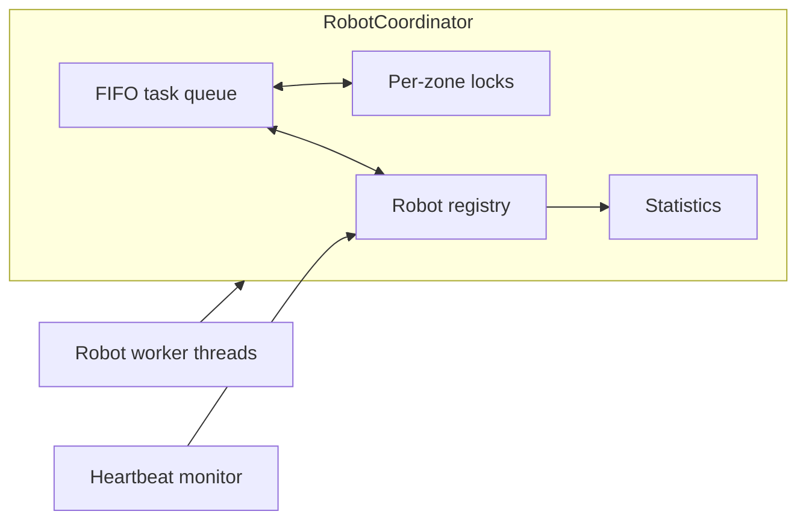

# TARDEM

[](https://github.com/littlecrawler/ICRAIC_2026_SourceCode/actions/workflows/ci.yml)

**A Rust-based concurrency testbed for healthcare service robot coordination.**

TARDEM (Task Allocation and Resource Dispatch Engine for Multi-Robot Systems)
is a compact, in-process simulator for studying shared task dispatch, exclusive
zone access, and heartbeat-based liveness monitoring. It makes the coordination
state and failure modes small enough to inspect and reproduce.

This repository does **not** implement robot navigation, networking, sensing,
actuation, or clinical safety. A passing simulation is not evidence that a
physical robot system is safe for hospital deployment.

## What is implemented

- A mutex-protected FIFO task queue shared by worker threads.
- One nonblocking mutex per zone, allowing work in different zones to overlap
  while preventing simultaneous occupancy of the same zone.
- A read-write-locked robot registry with idle, busy, and offline transitions.
- A three-second heartbeat timeout and offline-to-idle recovery path.
- Retry-safe dispatch: if a task's zone is occupied, the task moves to the back
  of the queue instead of being discarded.
- Runtime counters, six integration tests, and a reproducible scalability
  benchmark with raw observations.



The safe dispatch lifecycle is:

1. Validate that the robot is registered, responsive, and idle.
2. Pop the queue head while holding the queue lock.
3. Attempt its zone lock without blocking.
4. Requeue and report `ZoneBusy` on denial; otherwise mark the robot busy and
   return the task together with its lock guard.
5. Hold the guard during simulated work, release the zone, then complete the
   task.

## Quick start

Install a stable Rust toolchain with Rust 2024 edition support, then run:

```powershell
cd robot_coordination
cargo run
```

The demonstration covers concurrent processing, occupied-zone retry, and
heartbeat timeout/recovery. It takes several seconds because task durations and
the timeout are simulated with wall-clock sleeps.

## Validate the implementation

From `robot_coordination`:

```powershell
cargo fmt --all -- --check
cargo clippy --all-targets --all-features -- -D warnings
cargo test --all-targets
```

The current suite checks unique registration, FIFO queue behavior, zone mutual
exclusion, retry without task loss, heartbeat timeout and recovery, and a
concurrent ten-task run. Tests provide regression evidence for the exercised
schedules; they are not formal verification.

## Reproduce the scalability experiment

```powershell
cd robot_coordination
cargo run --release --bin benchmark
```

Defaults: 60 deterministic tasks, three round-robin zones, 20 ms of simulated
work per task, one through six worker threads, and ten runs per worker count.
The executable asserts complete task accounting in every run and writes both
raw and aggregated CSV files to the Git-ignored `benchmark-results/local/`
directory. This keeps new reproduction runs separate from the original
2026-09-15 measurements used by the paper.

| Workers | Mean throughput (tasks/s) | Mean run p95 (ms) | Mean denials | Jain fairness |
| ------: | ------------------------: | ----------------: | ------------: | ------------: |
| 1 | 49.074 | 1161.474 | 0.0 | 1.0000 |
| 2 | 98.123 | 590.254 | 0.0 | 1.0000 |
| 3 | 142.053 | 402.045 | 27.0 | 1.0000 |
| 4 | 141.733 | 402.907 | 284.9 | 0.9838 |
| 5 | 142.949 | 399.366 | 541.5 | 0.9660 |
| 6 | 144.282 | 395.400 | 792.2 | 0.9350 |

All 60 runs completed all 60 tasks with an empty residual queue. Throughput
plateaus once worker count reaches the three independent zones; extra workers
mainly add failed lock attempts. Both the [raw runs](benchmark-results/raw_runs.csv)
and [summary](benchmark-results/summary.csv) are versioned so readers can audit
individual observations or inspect the aggregate. See the
[benchmark protocol and environment](benchmark-results/README.md) for the
separate local-output workflow.

## Repository map

```text
.
|-- robot_coordination/                 Rust library, demos, tests, benchmark
|-- benchmark-results/                  2026-09-15 paper data; ignored local runs
|-- benchmark-scalability_.../          Separate earlier course-report experiments
`-- .github/workflows/ci.yml            Formatting, lint, and test checks
```

Manuscript files are kept outside the repository; `/paper/` is Git-ignored.

## Experimental data used in the paper

The paper uses the **original benchmark measurements recorded on 2026-09-15**:

- [`benchmark-results/raw_runs.csv`](benchmark-results/raw_runs.csv) contains
  the original measurements for each of the 60 runs.
- [`benchmark-results/summary.csv`](benchmark-results/summary.csv) contains
  statistics calculated from those measurements.

The experiment was run after the retry-safe dispatch fix: one through six
workers, ten runs per worker count, 60 tasks per run, three zones, and 20 ms
per task.

The 2026-09-24 manuscript revision adds capacity and retry-cost analysis of
these same observations; it does not report a newly collected batch of
experiments. Rebuilding this repository also left those CSV files unchanged.

The separate `benchmark-scalability_robot_counts_with_cpu/` directory contains
experiments from the earlier course report. Those files are retained for
historical reference and are not inputs to the current paper's performance
tables, throughput figure, or retry-cost calculations.
